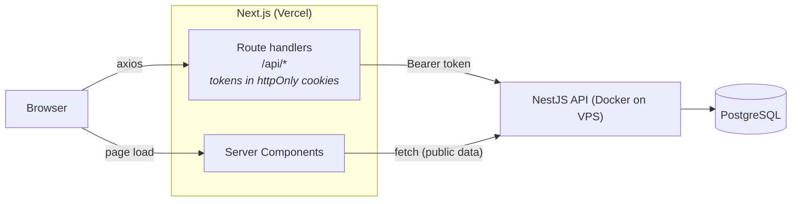

# E-Commerce Platform

A full-stack e-commerce app in an npm-workspaces monorepo. Shoppers browse and filter products, keep a cart, check out and see their order history. Admins can create and update products through the API.

## Tech stack

| Layer | Technology |
| --- | --- |
| Frontend | Next.js 16 (App Router), React 19, TanStack Query v5, Axios, Tailwind CSS v4, shadcn/ui |
| Backend | NestJS 11, TypeORM 0.3, Passport JWT |
| Database | PostgreSQL (a Docker Compose container in production) |
| Shared | `@e-com/shared`: TypeScript types and constants used by both apps |
| Hosting | Vercel (frontend), Docker on a shared VPS behind Caddy (backend) |

## How it fits together



## Quick start

Requires Node.js 20+, npm 10+ and a PostgreSQL database.

```bash
npm install
cp apps/backend/.env.example apps/backend/.env    # then fill in DATABASE_URL and JWT_SECRET
cp apps/frontend/.env.example apps/frontend/.env
npm run build -w @e-com/shared
npm run dev:backend    # http://localhost:3001
npm run dev:frontend   # http://localhost:3000
```

For the full setup, including migrations and seed data, see [docs/getting-started.md](docs/getting-started.md).

## Documentation

Start at the [docs index](docs/README.md).
