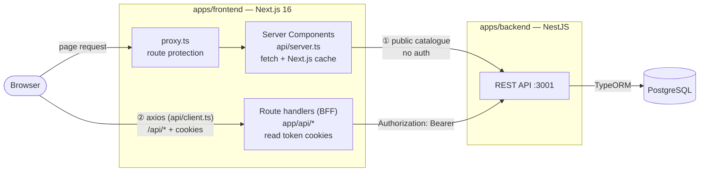
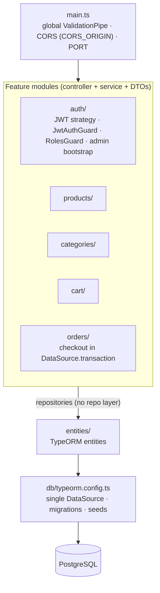

# Architecture

## Workspaces

The repo uses npm workspaces (`apps/*`, `packages/*`):

```text
apps/
  backend/     @e-com/backend   NestJS REST API
  frontend/    @e-com/frontend  Next.js App Router app
packages/
  shared/      @e-com/shared    types and constants used by both apps
```

## Request paths

The browser never talks to the backend directly. There are two paths:

1. **Server Components → backend.** Public catalogue data (products, categories) is fetched on the server with `fetch` in [`apps/frontend/api/server.ts`](../apps/frontend/api/server.ts), using Next.js caching. No auth is involved.
2. **Browser → Next.js route handlers → backend.** Anything tied to a user (auth, cart, orders) goes through the axios client in [`apps/frontend/api/client.ts`](../apps/frontend/api/client.ts) to `/api/*` handlers in [`apps/frontend/app/api/`](../apps/frontend/app/api). The handlers read the token cookies, call the backend with a `Bearer` header and relay the response. This layer is the BFF (backend for frontend). For why it exists, see [decision 0001](decisions/0001-bff-route-handlers-hold-tokens.md). For the handler list, see [api.md](api.md#nextjs-route-handlers-bff).

`BACKEND_URL` tells both paths where the backend is ([configuration.md](configuration.md)).



## Backend

[`apps/backend/src/`](../apps/backend/src) uses NestJS feature modules:

| Folder | Holds |
| --- | --- |
| `auth/` | Controller, service, JWT strategy, `JwtAuthGuard`, `RolesGuard` + `@Roles()`, admin bootstrap |
| `products/`, `categories/`, `cart/`, `orders/` | One module each: controller, service, DTOs |
| `entities/` | All TypeORM entities ([data-model.md](data-model.md)) |
| `db/` | `typeorm.config.ts` (the one `DataSource`, shared by the app, CLI and seed), `migrations/`, `seeds/` |
| `utils/slugify.ts` | Turns names into URL slugs |

[`main.ts`](../apps/backend/src/main.ts) sets up:

- **A global `ValidationPipe`** with `whitelist: true` (unknown body fields are stripped), `transform: true` and implicit conversion (query strings become numbers).
- **CORS** limited to `CORS_ORIGIN` with credentials, and off when that's unset outside production ([configuration.md](configuration.md#backend-appsbackend)). Nothing needs CORS today, because all browser traffic goes through the BFF, but it's there as a safeguard.
- **The listening port**: `PORT`, falling back to 3001.

Services use TypeORM repositories directly. There is no repository layer. Checkout runs inside a `DataSource.transaction`.



## Frontend

```text
apps/frontend/
  app/                 routes (see frontend.md), plus app/api/ route handlers
  api/                 server.ts (RSC fetch), client.ts (axios + refresh), service.ts (axios calls)
  hooks/               TanStack Query hooks: useAuth, useCart, useCheckout, useOrders
  components/          Navbar, Footer, Providers, RouteGuard, ThemeToggle, ui/ (shadcn)
  lib/                 cn(), getApiErrorMessage()
  proxy.ts             request-time route protection (Next.js 16's name for middleware)
  __tests__/, e2e/     Jest and Playwright tests
```

For routes, caching and hooks, see [frontend.md](frontend.md).

## Shared package

[`packages/shared/src/index.ts`](../packages/shared/src/index.ts) exports:

- **Runtime constants:** `AUTH_CONSTANTS` (token TTLs), `UserRole`, `OrderStatus`. These are `as const` objects with matching union types.
- **Interfaces:** `AuthUser`, `ILoginDto`, `IRegisterDto`, `ICategory`, `IProduct`, `IProductsQuery`, `IPaginatedProducts`, `ICartItem`, `IOrder`, `IOrderItem`, `IAddCartItemDto`, `IUpdateCartItemDto`.

Backend DTOs `implements` these interfaces, so request shapes stay aligned. The package compiles to CommonJS in `dist/` ([decision 0003](decisions/0003-shared-package-compiled-to-commonjs.md)).
