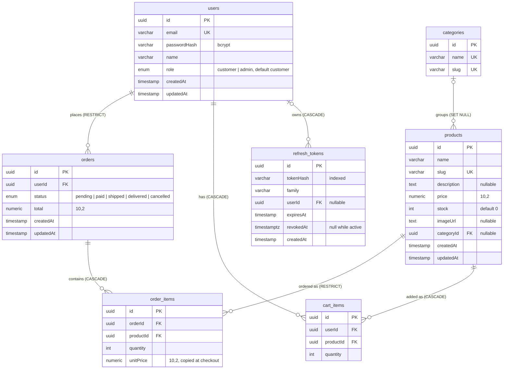
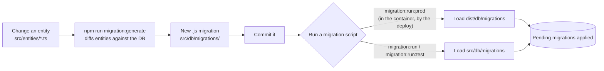

# Data model

The entities are in [`apps/backend/src/entities/`](../apps/backend/src/entities), and the schema itself is defined by [`src/db/migrations/`](../apps/backend/src/db/migrations). There's also an [interactive diagram on dbdiagram.io](https://dbdiagram.io/d/69c4fab0fb2db18e3b0d2095).

```text
users ──< orders ──< order_items >── products >── categories
users ──< cart_items >────────────── products
users ──< refresh_tokens
```

Relationship labels give the foreign key's `ON DELETE` rule ([Delete behaviour](#delete-behaviour)).

Every primary key is a `uuid` generated by the database.

## Tables

**`users`**: `email` (unique), `passwordHash` (bcrypt), `name`, `role` enum `customer | admin` (default `customer`), `createdAt`, `updatedAt`.

**`categories`**: `name` (unique), `slug` (unique).

**`products`**: `name`, `slug` (unique), `description` (text, nullable), `price` numeric(10,2), `stock` int (default 0), `imageUrl` (text, nullable), `categoryId` (nullable), `createdAt`, `updatedAt`.

**`cart_items`**: `userId`, `productId`, `quantity` int. There's no unique constraint on (user, product). The service merges duplicates itself ([api.md](api.md#cart)).

**`orders`**: `userId`, `status` enum `pending | paid | shipped | delivered | cancelled` (default `pending`), `total` numeric(10,2), `createdAt`, `updatedAt`. Nothing in the code changes `status` after checkout.

**`order_items`**: `orderId`, `productId`, `quantity` int, `unitPrice` numeric(10,2). The price is copied at checkout, so later product price changes don't affect past orders.

**`refresh_tokens`**: `tokenHash` (indexed), `family`, `userId`, `expiresAt`, `revokedAt` (timestamptz, null while active), `createdAt`. For how these are used, see [auth.md](auth.md#refresh-rotation).



## Delete behaviour

| Foreign key | On delete |
| --- | --- |
| `cart_items.userId`, `cart_items.productId` | CASCADE |
| `refresh_tokens.userId` | CASCADE |
| `order_items.orderId` | CASCADE |
| `order_items.productId` | RESTRICT: a product that has been ordered can't be deleted |
| `orders.userId` | RESTRICT: a user with orders can't be deleted |
| `products.categoryId` | SET NULL |

## Money

`price`, `total` and `unitPrice` are Postgres `numeric`. The `pg` driver returns them as **strings** (for example `"29.99"`), and TypeORM doesn't convert them, so the API sends strings. The frontend wraps them in `Number(...)` before doing arithmetic. The shared interfaces type these fields as `number` ([issue B5](issues.md#b5-money-fields-are-strings-typed-as-numbers)).

## Migrations

[`src/db/typeorm.config.ts`](../apps/backend/src/db/typeorm.config.ts) defines the one `DataSource` that the app, the TypeORM CLI and the seed all use ([decision 0009](decisions/0009-deploy-workflow-runs-migrations.md)):

- `synchronize: false`, so entity changes do nothing until you write a migration.
- **Starting the app never applies migrations.** A script applies them in every environment. You run it yourself in development and for the e2e database, and the deploy workflow runs it in production.
- Migrations are `.js` files. `nest-cli.json` copies them into `dist/`, and they're loaded from `dist/db/migrations` when `NODE_ENV=production` and from `src/db/migrations` otherwise.



Run these from the repo root. They read `apps/backend/.env`:

```bash
npm run migration:generate -w @e-com/backend   # diff entities against the DB and write a new migration
npm run migration:run -w @e-com/backend        # apply pending migrations
npm run migration:revert -w @e-com/backend     # undo the last one
```

| Script | Database | Runs through |
| --- | --- | --- |
| `migration:run` | `.env` | `ts-node` and `src/` |
| `migration:run:test` | `.env.test` | `ts-node` and `src/` |
| `migration:run:prod` | the container's `DATABASE_URL` | the `typeorm` CLI and the compiled `dist/`. Needs a build, and it's the only one that works in the production image ([deployment.md](deployment.md#migrations)) |

## Seeding

[`src/db/seeds/seed.ts`](../apps/backend/src/db/seeds/seed.ts):

1. **Deletes** every row in `order_items`, `orders`, `products` and `categories`. Cart items for those products go too, through the cascade.
2. Inserts 10 categories and 50 products with [faker](https://fakerjs.dev/) data, with random `loremflickr.com` / `picsum.photos` image URLs.

With `--if-empty`, it does nothing when the `products` table has at least one row. The deploy workflow runs it that way ([deployment.md](deployment.md#seeding), [decision 0010](decisions/0010-deploy-seeds-an-empty-database.md)).

It doesn't create any users. For an admin account, see [auth.md](auth.md#admin-bootstrap).

| Script | Environment | Runs |
| --- | --- | --- |
| `npm run seed:local -w @e-com/backend` | `.env` | `ts-node` and `src/` |
| `npm run seed:test -w @e-com/backend` | `.env.test` | `ts-node` and `src/` |
| `seed:prod` | the container's `DATABASE_URL` | the compiled `dist/db/seeds/seed.js`. Needs a build, and it's the only one that works in the production image |

Pass the flag after `--`, for example `npm run seed:local -w @e-com/backend -- --if-empty`.
